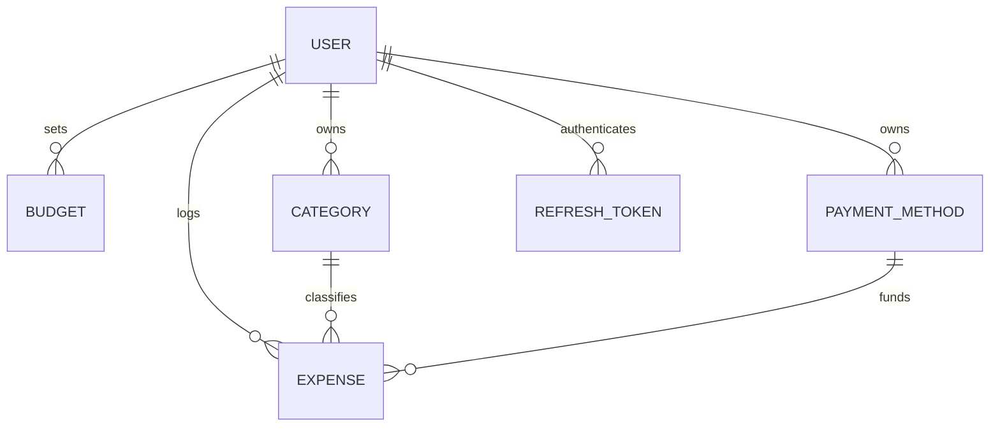
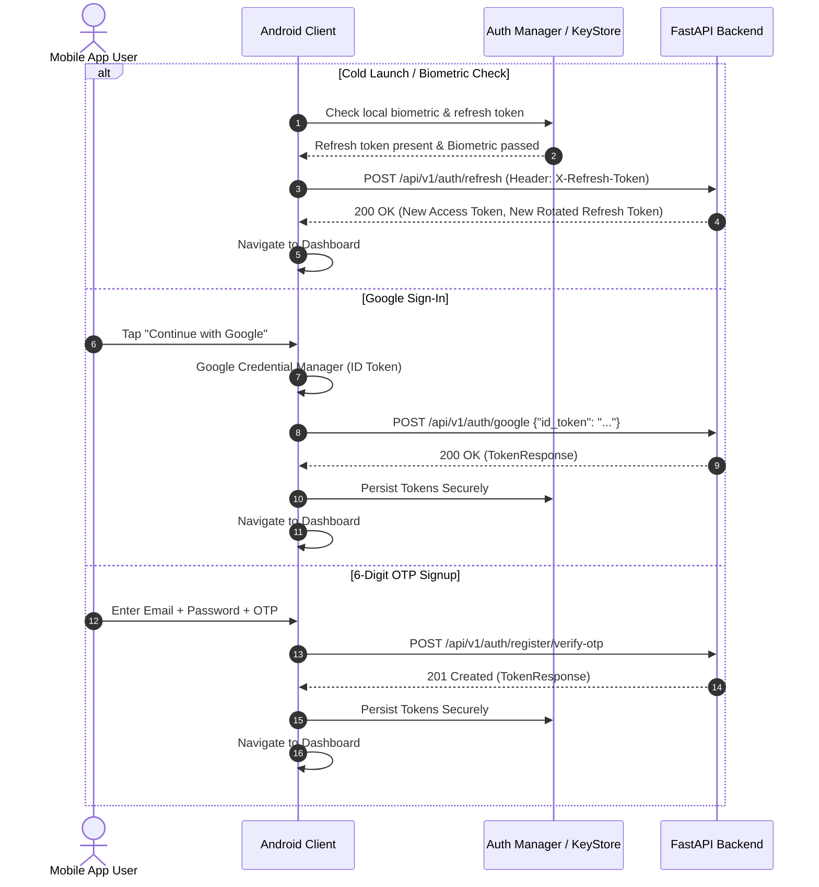
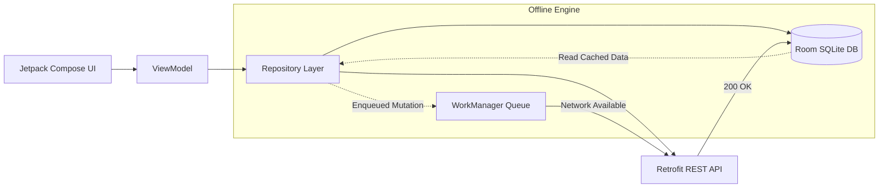

# Paradox Android App — Frontend Requirements Specification (FRS)

**Document Version:** 1.0  
**Status:** Approved  
**Target Platform:** Android (Kotlin, Jetpack Compose, Material 3, Room, Retrofit, Coroutines/Flow)  
**Backend:** FastAPI, PostgreSQL, SQLAlchemy Async, Alembic, JWT/OIDC  

---

## 1. Executive Summary & Product Objective

Paradox is an elite personal finance intelligence system engineered to bridge the gap between **spending money** and **understanding spending**. The Android mobile application is the primary daily client interface, built around the core financial loop:
$$\text{Record} \longrightarrow \text{Organize} \longrightarrow \text{Review} \longrightarrow \text{Understand} \longrightarrow \text{Adjust}$$

The application incorporates the **Obsidian Flow** design paradigm (OLED dark foundations, vibrant neon indicators, glassmorphic elevation surfaces, 24dp rounded corners, and full pill action controls) and delivers sub-10-second expense capture along with a 20-endpoint AI Copilot financial suite.

---

## 2. Core Entities & Data Architecture



### 2.1 Entity Schema Definitions

| Entity | Primary Fields | Types & Constraints | Business Rules |
| :--- | :--- | :--- | :--- |
| **`User`** | `id`, `email`, `password_hash`, `display_name`, `currency`, `created_at`, `updated_at` | `id`: UUID (PK)<br>`email`: VARCHAR(255) UNIQUE<br>`currency`: VARCHAR(3) DEFAULT 'INR' | Strict tenant isolation. Currency determines all display formatting. |
| **`Expense`** | `id`, `user_id`, `amount`, `description`, `date`, `category_id`, `payment_method_id`, `is_recurring`, `created_at`, `updated_at` | `id`: UUID (PK)<br>`user_id`: UUID (FK)<br>`amount`: NUMERIC(12,2) > 0<br>`date`: DATE<br>`category_id`: UUID (FK)<br>`payment_method_id`: UUID (FK)<br>`is_recurring`: BOOLEAN | Decimal monetary precision (no floating-point rounding errors). Immutable history audit. |
| **`Category`** | `id`, `user_id`, `name`, `is_starter`, `is_active`, `created_at`, `updated_at` | `id`: UUID (PK)<br>`user_id`: UUID (FK, Nullable for starter)<br>`name`: VARCHAR(50)<br>`is_starter`: BOOLEAN | Starter categories (Food, Groceries, Rent, Transport, etc.) are available globally; custom categories are private to user. |
| **`PaymentMethod`** | `id`, `user_id`, `name`, `is_starter`, `is_active`, `created_at`, `updated_at` | `id`: UUID (PK)<br>`user_id`: UUID (FK, Nullable for starter)<br>`name`: VARCHAR(50) | Starter methods (UPI, Credit Card, Debit Card, Cash, Net Banking) are available globally. |
| **`Budget`** | `id`, `user_id`, `amount`, `period_type`, `period_key`, `month`, `created_at`, `updated_at` | `id`: UUID (PK)<br>`user_id`: UUID (FK)<br>`amount`: NUMERIC(12,2)<br>`period_type`: ENUM ('month', 'week', 'day')<br>`period_key`: VARCHAR(20) | Unique `(user_id, period_type, period_key)`. Granular budgeting across months, weeks, or days. |
| **`RefreshToken`** | `id`, `user_id`, `token_hash`, `user_agent`, `expires_at`, `is_revoked`, `created_at` | `id`: UUID (PK)<br>`user_id`: UUID (FK)<br>`token_hash`: VARCHAR(255)<br>`expires_at`: TIMESTAMP | Rotates automatically upon every refresh request. Enables multi-account & multi-device sessions. |

---

## 3. Authentication & Session Management

### 3.1 Authentication Lifecycle



### 3.2 Authentication API Contracts

| Method & Route | Request Body | Response Payload | Description |
| :--- | :--- | :--- | :--- |
| `POST /api/v1/auth/login` | `{"email": str, "password": str}` | `TokenResponse`: `{access_token, refresh_token, token_type, user}` | Traditional password login |
| `POST /api/v1/auth/google` | `{"id_token": str}` | `TokenResponse` | Google OAuth2 / OpenID Connect |
| `POST /api/v1/auth/register/verify-otp` | `{"email": str, "otp_code": str, "password": str, "full_name": str?}` | `TokenResponse` | Instant 6-digit OTP registration |
| `POST /api/v1/auth/register/initiate` | `{"email": str}` | `{"message": str, "success": true}` | Magic link verification request |
| `GET /api/v1/auth/register/status?email=` | Query Param | `{"status": "pending"\|"verified", "can_resend": bool}` | Polling status for cross-device confirmation |
| `POST /api/v1/auth/refresh` | Cookie or `X-Refresh-Token` | `TokenResponse` | Silent rotation of credentials |
| `POST /api/v1/auth/switch-account` | `{"refresh_token": str}` | `TokenResponse` | In-app account switching |
| `POST /api/v1/auth/logout` | Refresh token | `{"message": "Successfully logged out."}` | Single-device session revocation |
| `POST /api/v1/auth/logout-all` | Bearer Header | `{"message": "Successfully logged out from all devices."}` | Revokes all active user tokens |
| `POST /api/v1/auth/forgot-password` | `{"email": str}` | `{"message": str}` | Password recovery link dispatch |
| `POST /api/v1/auth/reset-password` | `{"token": str, "new_password": str}` | `{"message": str}` | Completes password reset |
| `POST /api/v1/auth/change-password` | `{"current_password": str, "new_password": str}` | `{"message": str}` | Authenticated password change |
| `GET /api/v1/auth/me` | Bearer Header | `UserResponse` | Fetch authenticated profile |
| `PATCH /api/v1/auth/me` | `{"display_name": str?, "currency": str?}` | `UserResponse` | Update currency & profile name |

---

## 4. Core Financial CRUD Operations

### 4.1 Expense Ledger (`/api/v1/expenses`)

```
POST   /api/v1/expenses             --> Create Expense
GET    /api/v1/expenses             --> List Expenses (Search, Filter, Paginate, Sort)
GET    /api/v1/expenses/{id}        --> Retrieve Expense by ID
PATCH  /api/v1/expenses/{id}        --> Update Expense
DELETE /api/v1/expenses/{id}        --> Delete Expense
POST   /api/v1/expenses/import      --> Import CSV Statement (Multipart File)
GET    /api/v1/expenses/export      --> Export Expenses as CSV Stream
GET    /api/v1/expenses/recurring   --> List Recurring Subscriptions & Monthly Commitments
```

#### List Query Parameters
- `search`: Case-insensitive text match across description and category names.
- `category_id`: Single UUID filter.
- `date_from` & `date_to`: ISO-8601 date bounds (`YYYY-MM-DD`).
- `sort_by`: `date` (default), `amount`, or `category`.
- `sort_order`: `desc` (default) or `asc`.
- `page` & `page_size`: Pagination parameters (default: 1 & 20).

### 4.2 Categories & Payment Methods
- **`GET /api/v1/categories`**: Retrieves full list of active starter categories and custom user categories.
- **`POST /api/v1/categories`**: Creates a user-specific custom category (`{"name": "Investment"}`).
- **`PATCH /api/v1/categories/{id}`**: Renames existing custom category.
- **`DELETE /api/v1/categories/{id}`**: Deletes custom category (existing expenses automatically safe-reassigned).
- **`GET /api/v1/payment-methods`**: Lists all active payment methods.
- **`POST /api/v1/payment-methods`**: Creates custom payment method (e.g. `Sodexo`, `Crypto Wallet`).

### 4.3 Multi-Granularity Budgeting (`/api/v1/budget`)
- **`GET /api/v1/budget?period_type=month|week|day&period_key=...`**: Fetches active budget allocation for target period.
- **`PUT /api/v1/budget`**: Creates or modifies budget amount for designated timeframe.
- **`GET /api/v1/budget/all`**: Retrieves history of all set budgets.
- **`DELETE /api/v1/budget`**: Removes budget limit for selected period.

### 4.4 Dashboard Aggregation (`/api/v1/dashboard`)
- **`GET /api/v1/dashboard?period=current_month|last_30_days|current_week`**:
  - `total_spent`: Total aggregated outflow.
  - `total_budget`: Active period budget cap.
  - `remaining_budget`: Unspent buffer.
  - `category_breakdown`: Category names, total expenditures, and percentage shares.
  - `recent_expenses`: 10 most recent transactions.
  - `daily_trend`: Time-series array for trend line rendering.

---

## 5. AI Financial Intelligence Suite (20 Copilot Endpoints)

| Feature | Endpoint | Input | Output / Widget Specification |
| :--- | :--- | :--- | :--- |
| **1. Natural Language Parser** | `POST /ai/parse-expense` | `{"text": "350 dinner via UPI"}` | Structured expense draft (`amount`, `category`, `payment_method`, `date`). |
| **2. Multimodal OCR** | `POST /ai/scan-receipt` | Multipart Image File | Gemini Vision extraction of invoice total, merchant, date, tax. |
| **3. SMS Alert Parser** | `POST /ai/parse-sms` | `{"text": "A/c debited INR 850 at Starbucks"}` | Instant 1-tap floating confirmation pill. |
| **4. Pre-Purchase Simulator** | `POST /ai/simulate-purchase` | `{"amount": 4999, "category_name": "Gadgets"}` | "Can I Afford This?" verdict (`affordable: bool`, `impact_score: 1-100`, `projected_depletion_date`). |
| **5. Daily Safe-To-Spend** | `GET /ai/safe-to-spend` | None | `safe_daily_allowance`, `current_daily_burn_rate`, `burn_velocity: SAFE\|CAUTION\|DEFICIT`. |
| **6. Health Score (0-100)** | `GET /ai/health-score` | None | Overall financial health index (A/B/C/D grade) + Adherence, Velocity, and Discipline scores. |
| **7. Leak Hunter** | `GET /ai/leak-analysis?threshold=150` | `threshold` (e.g. ₹150) | Recurring micro-spend clusters + `annualized_leak_cost` (e.g. ₹40 daily chai = ₹14,600/yr). |
| **8. Subscription Audit** | `GET /ai/subscription-audit` | None | Recurring billing commitments, unused subscriptions, and overlapping services. |
| **9. 50/30/20 Rule** | `GET /ai/fifty-thirty-twenty` | None | Needs (50%), Wants (30%), Savings (20%) breakdown and variance indicators. |
| **10. Gamified Streaks** | `GET /ai/achievements` | None | `active_streak_days`, discipline milestone badges, motivational quotes. |
| **11. Finny AI Copilot Chat** | `POST /ai/chat` | `{"message": str, "history": [...]}` | Interactive LLM chat grounded in user's live budgets & transactions. |
| **12. Anomaly Spike Flag** | `GET /ai/anomalies` | None | Highlights statistical outliers (> 2.5 std dev) in spending ledger. |
| **13. 30-Day Forecast** | `GET /ai/forecast` | None | Predictive category-wise burn rate and projected end-of-month cash balance. |
| **14. Savings Roadmap** | `POST /ai/savings-plan` | `{"goal_name": "MacBook", "target_amount": 120000, "target_months": 6}` | Recommended monthly savings quotas and category budget reductions. |
| **15. Sentiment & Remorse** | `POST /ai/analyze-sentiment` | `{"text": "Impulsive shopping", "amount": 8000}` | Psychological trigger tagging (`remorseful`, `impulsive`, `necessity`). |
| **16. Monthly Wrapped** | `GET /ai/monthly-wrapped?month=YYYY-MM` | `month` | Spotify-Wrapped style retrospective story carousel and personality archetype. |
| **17. Vibe Check & Roast** | `GET /ai/vibe-check?roast_mode=true` | `roast_mode: bool` | Spicy Hinglish / humorous commentary based on burn velocity. |
| **18. Smart Budget Suggest** | `GET /ai/suggest-budget?period_type=month` | `period_type` | 90-day pattern-based conservative, moderate, and aggressive budget caps. |
| **19. Auto-Categorization** | `POST /ai/categorize` | `{"description": "Uber Ride"}` | Suggested category name + confidence score. |
| **20. Duplicate Check** | `POST /ai/check-duplicate` | `{"amount": 450, "date": "2026-09-09", "description": "Swiggy"}` | Real-time candidate duplicate transaction warning (+/- 3 days). |

---

## 6. End-to-End User Journey Specifications

### Journey 1: User Onboarding & Auth
1. **Splash Screen**: 2.0s animated Paradox "P" gradient emblem cold-launch.
2. **Login / Register**:
   - Tabbed or single-action Obsidian Flow container.
   - Option for Instant 6-digit OTP signup or Google 1-Tap sign-in.
3. **Biometric Enrollment**:
   - Prompts for Fingerprint / Face Unlock using Android `BiometricPrompt` and Android KeyStore hardware crypto.
4. **Currency Selector**:
   - Setup default display currency (`₹ INR`, `$ USD`, `€ EUR`, etc.).

### Journey 2: Frictionless Daily Expense Capture (< 10 Seconds)
1. **Quick-Add Floating Action / Monolith**: Accessible from any screen.
2. **Three Input Modes**:
   - **Mode A: Numeric Keypad**: Amount input -> Category squircle tile -> 1-tap save.
   - **Mode B: Natural Language / Voice**: *"Paid 450 for lunch via UPI"* -> AI parses amount, category, payment method.
   - **Mode C: Camera OCR**: Snaps physical receipt -> Gemini Vision auto-fills items.
3. **Duplicate Prevention**: If identical transaction occurred in past 3 days, warning banner prompts confirmation.

### Journey 3: Financial Command Center (Dashboard)
1. **Header**: Live greeting, profile avatar, "Vault Alpha • Tier 1" status dot, and "256-BIT" encryption badge.
2. **Net Worth Hero Card**: Tabular currency display, monthly delta percentage (`+14.2%`), and eye visibility toggle.
3. **Monthly Spend Cap Micro-Tracker**: Multi-color gradient progress bar (`Emerald -> Teal -> Cyan`) with Safe-to-Spend daily burn rate pill (`Safe: ₹740 / day`).
4. **4-Column Quick Action Monoliths**: `Add Log`, `Insights`, `Finny AI`, and `Budgets`.
5. **Interactive Velocity Curve**: 7-day trend chart with peak callout marker.
6. **Breakdowns & 50/30/20 Rule**: Multi-tint category progress bars and Needs/Wants/Savings distribution.

### Journey 4: Pre-Purchase Simulator ("Can I Afford This?")
1. User enters prospective purchase cost (e.g. `₹4,999`) before checking out.
2. App runs simulation against remaining month days and active spend cap.
3. Renders instant decision card:
   - **Green**: Safe to buy (maintains healthy daily allowance).
   - **Amber**: Tight (reduces daily allowance significantly).
   - **Red**: Deficit warning (predicts budget breach before month end).

### Journey 5: Leak Hunter & Subscription Guardian
1. **Leak Analysis**: Scans transactions under ₹150; identifies habitual micro-drains (chai, sodas, in-app purchases).
2. **Cumulative Annual Impact**: Visualizes annualized drain (e.g. ₹40/day = ₹14,600/year).
3. **Subscription Audit**: Lists active recurring commitments, flags overlapping services, and alerts on upcoming renewals.

### Journey 6: Conversational Finny AI Copilot
1. Conversational chat interface with quick suggestion chips (*"Where did my money go?"*, *"Can I afford dinner tonight?"*).
2. Responses grounded in live SQL financial records without exposing user credentials.

### Journey 7: Monthly Wrapped Retrospective
1. End-of-month Spotify-Wrapped style interactive story deck.
2. Displays top spending category, most frequented merchant, biggest splurge, financial personality archetype, and total savings generated.
3. 1-tap export to Android native share sheet for social sharing.

---

## 7. Offline-First Architecture & Sync Strategy



1. **Room Local Cache**: Entities cached locally in SQLite via Android Room.
2. **Offline Mutation Queue**: When offline, write operations are stored with `sync_status = PENDING`.
3. **WorkManager Background Sync**: Once network connectivity is restored, mutations are sequentially dispatched to backend.
4. **Authoritative Timestamping**: Backend server timestamps take precedence in multi-device conflict resolution.

---

## 8. Security & Compliance Standards

- **Hardware Token Storage**: All JWT access and refresh tokens stored in Android `EncryptedSharedPreferences` backed by hardware KeyStore.
- **Network Security**: Strict TLS 1.3 requirement; certificate pinning for production builds.
- **Biometric Gatekeeping**: Cryptographic `BiometricPrompt` cipher validation before decrypting stored session keys.
- **Zero Secrets Rule**: No hardcoded API keys or secrets in mobile source code.
