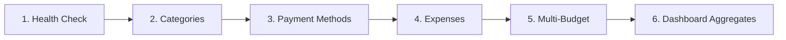

# Postman Testing Guide: Paradox API

This guide provides step-by-step instructions for testing the Paradox REST API using Postman, covering import setup, environment switching, manual verification flows, and automated batch runs.

---

## 1. Prerequisites: Start the Backend Server

Before running requests against your local environment, ensure the FastAPI backend is running:

```powershell
# From the project root:
cd backend
.venv\Scripts\uvicorn app.main:app --reload --port 8000
```

> [!NOTE]
> The backend automatically runs Alembic migrations and seeds default starter entities on boot. Check that `http://localhost:8000/docs` is accessible in your browser.

---

## 2. Importing Collection & Environment into Postman

1. Open **Postman**.
2. Click the **Import** button (top-left workspace menu).
3. Drag & drop or browse to select the following files:
   - `Paradox.postman_collection.json` (The API collection)
   - `Paradox.postman_environment.json` (Local environment variables)
   - *(Optional)* `Paradox.postman_production_environment.json` (Render production environment)
4. Click **Import**.

---

## 3. Selecting Your Environment

1. In the top-right corner of Postman, find the **Environment dropdown** (initially says *No Environment*).
2. Select **`Paradox - Local Development`**.
3. Verify the variables by clicking the **Eye icon** (Environment quick look):
   - `baseUrl`: `http://localhost:8000`
   - `categoryId`: `11111111-1111-1111-1111-111111111111` (Starter default: *Food & Dining*)
   - `paymentMethodId`: `aaaaaaaa-aaaa-aaaa-aaaa-aaaaaaaaaaaa` (Starter default: *Cash*)

---

## 4. End-to-End Testing Walkthrough

Follow this logical sequence to test every backend feature:



### Phase 1: Health & Database Diagnostics
1. Expand folder **`1. Health & Diagnostics`**.
2. Send **`Health Check (DB Connectivity)`**.
   * **Expected Status**: `200 OK`
   * **Expected Body**:
     ```json
     {
       "status": "ok",
       "database": "connected"
     }
     ```

---

### Phase 2: Categories (CRUD & Cascade Reassignment)
1. Expand folder **`3. Categories`**.
2. Send **`List All Categories`** (`GET /api/v1/categories`):
   * Verifies starter categories (*Food & Dining, Transportation, Groceries, Uncategorized*, etc.).
3. Send **`Create Custom Category`** (`POST /api/v1/categories`):
   * Body: `{"name": "Travel & Leisure"}`
   * **Expected Status**: `201 Created`
   * *The Postman test script automatically updates `{{customCategoryId}}` and `{{categoryId}}`.*
4. Send **`Get Category by ID`** (`GET /api/v1/categories/{{categoryId}}`):
   * **Expected Status**: `200 OK` (fetches the newly created category).
5. Send **`Rename Category`** (`PATCH /api/v1/categories/{{categoryId}}`):
   * Body: `{"name": "Travel, Flights & Leisure"}`
   * **Expected Status**: `200 OK`
6. *(Optional)* Send **`Delete Custom Category`** (`DELETE /api/v1/categories/{{customCategoryId}}`):
   * **Expected Status**: `204 No Content`
   * Note: Deleting a category automatically cascades referencing expenses to `Uncategorized`.

---

### Phase 3: Payment Methods (CRUD)
1. Expand folder **`4. Payment Methods`**.
2. Send **`List All Payment Methods`** (`GET /api/v1/payment-methods`):
   * Lists *Cash, Debit Card, Credit Card, Bank Transfer, Digital Wallet, Other*.
3. Send **`Create Custom Payment Method`** (`POST /api/v1/payment-methods`):
   * Body: `{"name": "Crypto Wallet"}`
   * **Expected Status**: `201 Created`
   * *Automatically updates `{{customPaymentMethodId}}` and `{{paymentMethodId}}`.*
4. Send **`Rename Payment Method`** (`PATCH /api/v1/payment-methods/{{paymentMethodId}}`):
   * Body: `{"name": "Crypto / Web3 Wallet"}`
   * **Expected Status**: `200 OK`
5. Send **`Delete Custom Payment Method`** (`DELETE /api/v1/payment-methods/{{customPaymentMethodId}}`):
   * **Expected Status**: `204 No Content`

---

### Phase 4: Expenses (Transactions, Filters & Pagination)
1. Expand folder **`5. Expenses`**.
2. Send **`Create Expense`** (`POST /api/v1/expenses`):
   * Body:
     ```json
     {
       "amount": 42.50,
       "category_id": "{{categoryId}}",
       "payment_method_id": "{{paymentMethodId}}",
       "date": "2026-08-28",
       "description": "Team lunch at gourmet cafe"
     }
     ```
   * **Expected Status**: `201 Created`
   * *Automatically saves `{{expenseId}}` for downstream tests.*
3. Send **`List Expenses (Paginated & Sorted)`** (`GET /api/v1/expenses?page=1&page_size=20&sort_by=date&sort_order=desc`):
   * Verifies the paginated envelope (`data` array and `meta` object with total counts).
4. Send **`Search Expenses (Free Text)`** (`GET /api/v1/expenses?search=lunch`):
   * Verifies case-insensitive substring search.
5. Send **`Filter Expenses by Category`** (`GET /api/v1/expenses?category_id={{categoryId}}`):
   * Tests single-dimension category filter.
6. Send **`Filter Expenses by Date Range`** (`GET /api/v1/expenses?date_from=2026-08-01&date_to=2026-08-31`):
   * Tests date filtering.
7. Send **`Get Single Expense`** (`GET /api/v1/expenses/{{expenseId}}`):
   * **Expected Status**: `200 OK`
8. Send **`Update Expense (Partial PATCH)`** (`PATCH /api/v1/expenses/{{expenseId}}`):
   * Modifies amount or description.
   * **Expected Status**: `200 OK`
9. *(Optional)* Send **`Delete Expense`** (`DELETE /api/v1/expenses/{{expenseId}}`):
   * **Expected Status**: `204 No Content`

---

### Phase 5: Budget Planning (Multi-Granularity)
1. Expand folder **`6. Budget Planning (Multi-Granularity)`**.
2. Send **`Upsert Monthly Budget`** (`PUT /api/v1/budget`):
   * Body: `{"amount": 3500.00, "period_type": "month", "period_key": "2026-08"}`
   * **Expected Status**: `200 OK`
3. Send **`Upsert Weekly Budget`** (`PUT /api/v1/budget`):
   * Body: `{"amount": 800.00, "period_type": "week", "period_key": "2026-W35"}`
   * **Expected Status**: `200 OK`
4. Send **`Upsert Daily Budget`** (`PUT /api/v1/budget`):
   * Body: `{"amount": 120.00, "period_type": "day", "period_key": "2026-08-28"}`
   * **Expected Status**: `200 OK`
5. Send **`List All Configured Budgets`** (`GET /api/v1/budget/all`):
   * Verifies that all 3 granularities are returned.
6. Send **`List Budgets Filtered by Granularity`** (`GET /api/v1/budget/all?period_type=month`):
   * Verifies filtering by granularity.
7. Send **`Get Monthly Budget`** (`GET /api/v1/budget?period_type=month&period_key=2026-08`):
   * Returns current target for August 2026.

---

### Phase 6: Dashboard & Analytics
1. Expand folder **`2. Dashboard & Analytics`**.
2. Send **`Get Dashboard (Current Month)`** (`GET /api/v1/dashboard?period=current_month`):
   * Verifies `total_spent`, `budget` (spent vs limit and status alert), `category_breakdown`, `top_categories`, `trend` (6 past months), and `recent_expenses`.
3. Send **`Get Dashboard (Current Week)`** (`GET /api/v1/dashboard?period=current_week`):
   * Verifies weekly trend rollup.
4. Send **`Get Dashboard (Last 30 Days)`** (`GET /api/v1/dashboard?period=last_30_days`):
   * Verifies 30-day rolling aggregate.

---

## 5. Automated Collection Run (Postman Runner)

To execute all test requests sequentially:

1. Click on **Paradox API Collection** in the left sidebar.
2. Click the **Run** button (top right of collection header).
3. Select the requests you wish to include.
4. Select Environment: **`Paradox - Local Development`**.
5. Click **Run Paradox API Collection**.
6. View the real-time execution log and status codes.

---

## 6. Command-Line Testing with Newman (CI/CD)

You can run the full collection from your command prompt without opening the Postman UI:

```powershell
# Run using npx (no global install required)
npx newman run Paradox.postman_collection.json -e Paradox.postman_environment.json
```

---

## 7. Common HTTP Status Codes Reference

| Code | Meaning | Expected Scenarios |
| :--- | :--- | :--- |
| `200 OK` | Success | GET, PATCH, and PUT requests |
| `201 Created` | Resource Created | POST `/expenses`, `/categories`, `/payment-methods` |
| `204 No Content` | Deleted Successfully | DELETE `/expenses/{id}`, `/categories/{id}`, `/budget` |
| `400 Bad Request` | Validation Error | Negative amounts, empty names, invalid UUID formats |
| `404 Not Found` | Not Found | Non-existent ID query or unconfigured budget record |
| `503 Service Unavailable`| DB Offline | Database disconnected during health check |
